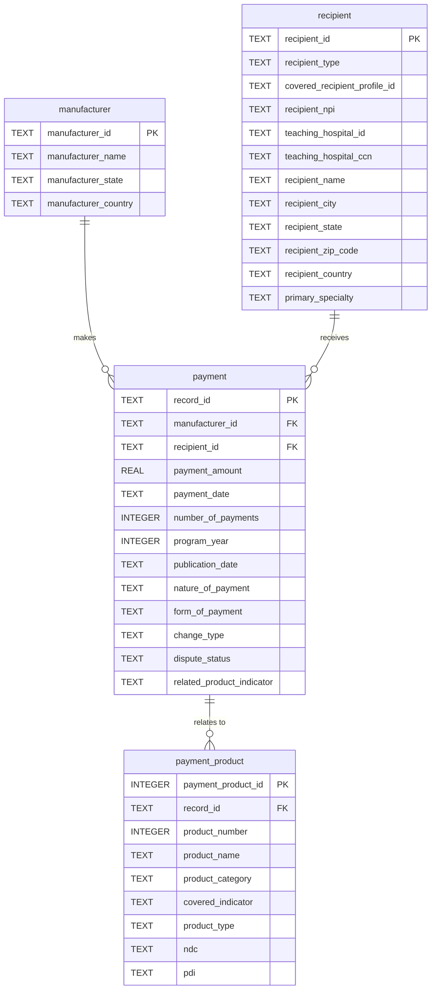

# Entity-Relationship Diagram

`stg_general_payments` is the source-shaped staging landing table. The four normalized tables below are built from it.



## Pipeline flow

```
CSV distribution ──stream+filter──> stg_general_payments ──build_final_tables.sql──> manufacturer
                                                                                     recipient
                                                                                     payment
                                                                                     payment_product
```
